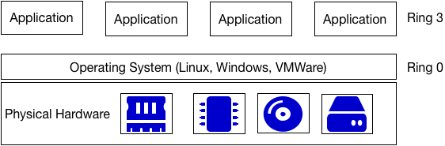
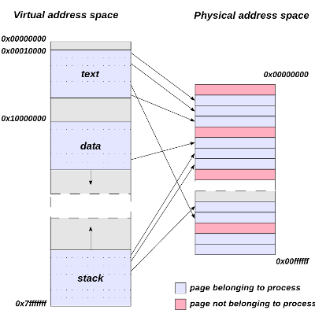
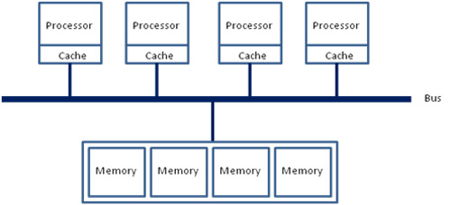
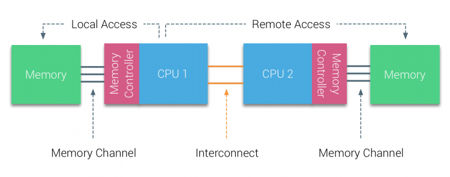

---

## Intel CPU's, Virtualization and You!

Will Fife  
wfife@laika.com

---?image=assets/image/system360-67.jpg&size=cover&opacity=20

## The early days of Virtualization:

#### 1964 / 1965: CP-40 and IBM System/360-67

CP-40 was a revolutionary research operating system that supported virtual machines, virtual memory and more.  Both CP-40 and 

---
@transition[none]

The early days of Virtualization on hardware that is affordable by mere mortals.

@ul[circles]
- 1994: Bochs
- 1997: Virtual PC
- 1999: VMWare Virtual Platform
- 2003: First release of Xen
- 2007: First release of KVM, integrated with the Linux kernel, requires hardware support.
- 2007: First release of VirtualBox
@ulend

---

@transition[none]

## Trap and Emulate Virtualization

x86 processors have different "protection rings".

@ul[circles]
- Ring 0 can do anything it wants with hardware
- Ring 3 can crash at any time without impacting anything else.
- Ring 1 & 2 are almost never used. @note[There are other rings, but those only come into play if we turn this into a security talk.]
@ulend

---



Note:

- This presents a problem for running a virtualized guest, if it wants to write to video memory it needs Ring 0 access but is running in ring 3.
- Typically 10x slower than bare meta.
- Slow, hacky and complex.

---

@transition[fade]

## Intel Virtualization Technologies

@ul[circles]
- 2006 - Intel VT-x
- 2008 - Intel EPT
- 2009 - Intel VT-d
- 2013 - Intel APICv
- 2012 - SR-IOV
@ulend

Note:

- EPT was first available on Desktop CPU's, EPT and VT-d arrived on Xeon CPU's with the Nehalem architecture.

---

2006 Hardware Virtualization came to intel


---

## Hardware-assisted virtualization

Intel (VT-x) introduced in 2006

Note:

- Used by hypervisor to handle privileged intructions, they add new instructions that permit entering and exiting a virtual execution mode where the guest OS perceives itself as running with full privilege (ring 0), but the host OS remains protected.

---

## MMU Virtualization

#### Intel EPT (Extended Page Tables)

Note:

- Virtualized MMU for the Guest OS, so the host OS doesn't have to manage shadow page tables. 

---

## Virtual Memory




Note:

- Modern Operating Systems manage translating
- Modern Operating Systems use a combination of hardware MMU and software to map the virtual addresses of processes onto the physical addresses of the computers memory.

---

## Interrupt virtualization and I/O MMU virtualization 

#### Intel VT-d


Note:

- This is PCI passthrough
- This allows things like network and video passthrough to guest VM's

---

## SR-IOV

Note:

- This allows a PCIe device to be carved up and divied out to multipe VM's
- Each VM can have a physical network card
- Each VM can have part of a GPU (Tesla)

---

## Linux and KVM

```
cat /proc/cmdline
BOOT_IMAGE=/vmlinuz-4.15.15-200.fc26.x86_64         \
    root=/dev/mapper/basevg-root ro                 \
    rd.lvm.lv=basevg/root nouveau.modeset=0         \
    rd.blacklist=nouveau modprobe.blacklist=nouveau \
    rd.driver.pre=vfio-pci                          \
    pci-stub.ids=10de:1bb1,10de:10f0,6549:2200      \
    intel_iommu=on iommu=pt 
```

Note:

- If you are passing through an NVIDIA ard, you need to disable the nouveau driver

---

## IOMMU and Linux

```
intel_iommu=on
iommu=pt
```

Note:

- iommu=pt is iommu = pass through.  disable Dynamic DMA remapping in the linux kernel.
- The pt option only enables IOMMU for devices used in passthrough and will provide better host performance.

---

## PCI Device and Vendor ID's

```
lspci -vnn
3b:00.0 VGA compatible controller [0300]: NVIDIA Corporation GP104GL [Quadro P4000] [10de:1bb1] (rev a1) (prog-if 00 [VGA controller])
        Subsystem: Dell Device [1028:11a3]
        Flags: bus master, fast devsel, latency 0, IRQ 235, NUMA node 0
        Memory at 96000000 (32-bit, non-prefetchable) [size=16M]
        Memory at afe0000000 (64-bit, prefetchable) [size=256M]
        Memory at aff0000000 (64-bit, prefetchable) [size=32M]
        I/O ports at 6000 [size=128]
        Expansion ROM at 97080000 [disabled] [size=512K]
        Capabilities: [60] Power Management version 3
        Capabilities: [68] MSI: Enable+ Count=1/1 Maskable- 64bit+
        Capabilities: [78] Express Legacy Endpoint, MSI 00
        Capabilities: [100] Virtual Channel
        Capabilities: [250] Latency Tolerance Reporting
        Capabilities: [128] Power Budgeting <?>
        Capabilities: [420] Advanced Error Reporting
        Capabilities: [600] Vendor Specific Information: ID=0001 Rev=1 Len=024 <?>
        Capabilities: [900] #19
        Kernel driver in use: vfio-pci
        Kernel modules: nouveau
```

---

## The PCI Stub driver (pre 4.1)

#### The kernel command line is where you attach devices to the pci-stub driver

```
pci-stub.ids=10de:1bb1,10de:10f0,6549:2200   
```

---

## VFIO (Virtual Function I/O)

```
cat /etc/modprobe.d/vfio.conf
options vfio-pci ids=10de:1bb1,10de:10f0,6549:2200 
```

---

## CPU Pinning

```
virsh edit [vmname]
<vcpu placement='static'>4</vcpu>
<cputune>
    <vcpupin vcpu='0' cpuset='2'/>
    <vcpupin vcpu='1' cpuset='6'/>
    <vcpupin vcpu='2' cpuset='3'/>
    <vcpupin vcpu='3' cpuset='7'/>
</cputune>
...
<cpu mode='custom' match='exact'>
    ...
    <topology sockets='1' cores='2' threads='2'/>
    ...
</cpu>
```

Note:

- Assuming Hyperthreading
- Assuming you want your guest to see the CPU like it actually is.
```

---

## Memory


---

## UMA


---

## UMA (Uniform Memory Access)



---

## NUMA (Non-Uniform Memory Access)



---

## Huge Pages

- Transparent Huge Pages
- Static Huge Pages

---

## Static Huge Pages

```
virsh edit [vmname]
<memoryBacking>
    <hugepages/>
</memoryBacking>
```

##### Kernel Command Line Arguments

```
default_hugepagesz=1G hugepagesz=1G hugepages=256 transparent_hugepage=never
```

---

## Passing through a video card

- 3D applications
- CUDA Applications
- Machine Learning
- Video Games

---

## Kill Nouveau

```
cat /etc/modprobe.d/nouveau.conf
blacklist nouveau
options nouveau modeset=0
```

Note:

- nouveau is the open source NVIDIA driver, it is great if you are a purist

---

@transition[slide]

## Open Virtual Machine Firmware (OVMF)

@ul[circles]
- You might be tempted to try and get this to work with SeaBIOS
- Don't
- Just use OVMF
@ulend

---

## NVIDIA Drivers under Windows

```
virsh edit [vmname]
<features>
    <hyperv>
        ...
        <vendor_id state='on' value='whatever'/>
        ...
    </hyperv>
    <kvm>
        <hidden state='on'/>
    </kvm>
</features>
---


---

References and Copyrights

* IBM System 360-67 http://history.cs.ncl.ac.uk/anniversaries/40th/images/ibm360_672/slide20.html
* Virtual Memory Image: Copyright © [en:User:Dysprosia](https://en.wikipedia.org/wiki/User:Dysprosia)


